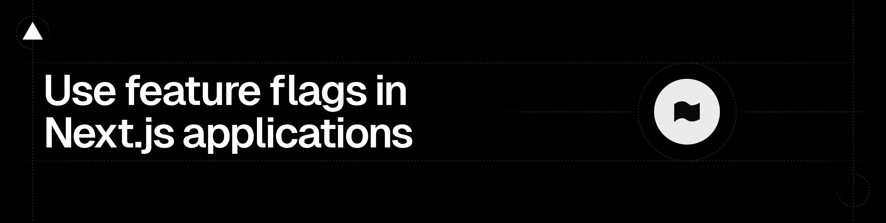

# Flags SDK

The feature flags toolkit for Next.js, SvelteKit and TanStack Start.

From the creators of Next.js, the Flags SDK is a free open-source library that gives you the tools you need to use feature flags in Next.js, SvelteKit and TanStack Start applications.

- Works with any flag provider, custom setups or no flag provider at all
- Compatible with App Router, Pages Router, and Routing Middleware
- Built for feature flags and experimentation

See [flags-sdk.dev](https://flags-sdk.dev/) for full docs and examples.

> Upgrading from version 3? See the [Upgrade to v4](https://github.com/vercel/flags/blob/main/packages/flags/guides/upgrade-to-v4.md) guide.

## Installation

Install the package using your package manager:

```sh
npm install flags
```

## Setup

Create an environment variable called `FLAGS_SECRET`.

The `FLAGS_SECRET` value must have a specific length (32 random bytes encoded in base64) to work as an encryption key. Create one using node:

```sh
node -e "console.log(crypto.randomBytes(32).toString('base64url'))"
```

Use a separate `FLAGS_SECRET` value for each environment (Development, Preview, Production), and mark the Preview and Production values as Sensitive. Run the generator once per environment to produce distinct values, then store each on Vercel:

```sh
vercel env add FLAGS_SECRET production --sensitive --value <production-secret>
vercel env add FLAGS_SECRET preview --sensitive --value <preview-secret>
vercel env add FLAGS_SECRET development --value <development-secret>
```

This secret is required to use the SDK. It is used to read overrides and to encrypt flag values in case they are sent to the client and should stay secret.

## Usage

Create a file called flags.ts in your project and declare your first feature flag there:

```ts
// app/flags.tsx
import { flag } from "flags/next";

export const exampleFlag = flag<boolean>({
  key: "example-flag",
  decide() {
    return true;
  },
});
```

Call your feature flag in a React Server Component:

```tsx
// app/page.tsx
import { exampleFlag } from "./flags";

export default async function Page() {
  const example = await exampleFlag();
  return <div>{example ? "Flag is on" : "Flag is off"}</div>;
}
```

Feature Flags can also be called in Routing Middleware and API Routes.

### TanStack Start

Import `flag` from `flags/tanstack-start` and evaluate flags inside a route
loader, server function, or server route — the request is resolved automatically:

```ts
// src/flags.ts
import { flag } from "flags/tanstack-start";

export const exampleFlag = flag<boolean>({
  key: "example-flag",
  decide: () => true,
});
```

```tsx
// src/routes/index.tsx
import { createFileRoute } from "@tanstack/react-router";
import { exampleFlag } from "../flags";

export const Route = createFileRoute("/")({
  loader: async () => ({ example: await exampleFlag() }),
  component: Home,
});

function Home() {
  const { example } = Route.useLoaderData();
  return <div>{example ? "Flag is on" : "Flag is off"}</div>;
}
```

You can expose the flags discovery endpoint for the Vercel Toolbar with a server
route:

```ts
// src/routes/.well-known/vercel/flags.ts
import { createFileRoute } from "@tanstack/react-router";
import {
  createFlagsDiscoveryEndpoint,
  getProviderData,
} from "flags/tanstack-start";
import * as flags from "../../../flags";

const handler = createFlagsDiscoveryEndpoint(() => getProviderData(flags));

export const Route = createFileRoute("/.well-known/vercel/flags/")({
  server: { handlers: { GET: handler } },
});
```

## Adapters

The Flags SDK has adapters for popular feature flag providers including LaunchDarkly, Optimizely, and Statsig.

## Documentation

There is a lot more to the Flags SDK than shown in the example above.

See the full documentation and examples on [flags-sdk.dev](https://flags-sdk.dev/).
