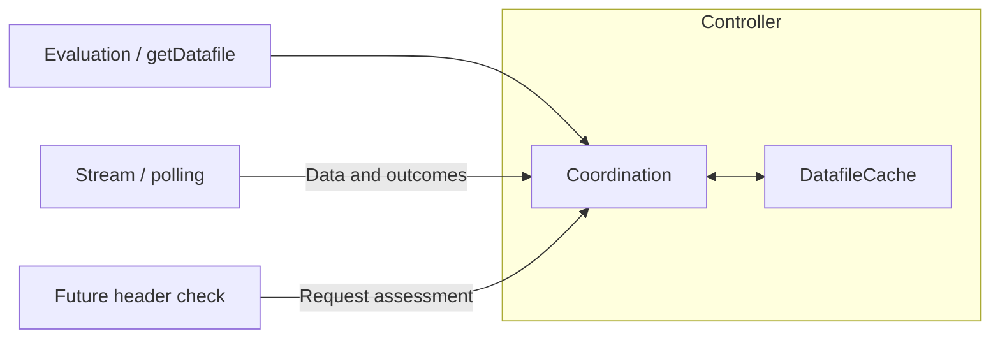

# Cache ownership and extension boundary

The controller owns one `DatafileCache` containing the current tagged datafile.
Sources obtain data and report outcomes. The controller selects the mode and source
origin, and forwards data and evidence. The cache applies version acceptance, tags
accepted updates, records the first consecutive failure, and decides whether the
entry may be served.

## One serving policy

`read()` is the only full-entry read. The cache receives `staleIfErrorMs` once at
construction. The controller's evaluations and `getDatafile()` use this cache
read policy within their existing data resolution and public-view construction.
Their loading paths and metrics stay intact: `getDatafile()` can still load a
snapshot without starting stream/poll initialization. `getFallbackDatafile()`
remains an independent bundled-data export.

`hasData` and `revision` expose only coordination metadata. An expired entry still
exists and its revision can be sent when reconnecting, without serving its data or
starting a fallback load just because SIE expired. No separate raw-entry read or
mutable `isFresh` flag is needed.

`seed()` stores initial or fallback snapshots; `clear()` removes storage. Neither
operation erases an outage or renews its deadline. Seeds include provided/bundled
restoration, build data, and snapshot/offline fallback loads.

`updateFromSource()` applies the existing version predicate, tags/stores accepted
updates, and clears failure. Missing or unparseable versions retain their existing
acceptance behavior. Responses rejected as replacements can still confirm an equal
finite `configUpdatedAt` for the same project/environment via `tryConfirm()`.
Confirmation does not replace or retag data. Object identity alone is insufficient.

## Source evidence

| Evidence | Cache effect |
| --- | --- |
| Accepted stream/poll data | Store and clear failure |
| Valid same-version response | Clear failure without replacement |
| Stream `primed` with matching finite numeric revision and identity | Clear failure without replacement |
| Poll error or stream error | Retain the first failure and its time |
| Stream disconnect, including clean EOF or ping timeout | Record `stream: disconnected` unless a failure already exists |
| Repeated failure or fallback seed | Preserve the original error/deadline |
| Connection opening, ping, invalid/old confirmation | Do not clear failure |
| Initialization timeout alone | Do not start failure |

Positive finite SIE windows include the exact deadline; zero disables fallback
immediately, and `Infinity` preserves unlimited fallback. Healthy data has no
age-based expiry. Expired entries remain stored, and reads start no extra fetch.
Accepted or valid confirmed data restores reads; a later failure starts a new
allowance. Existing defaults, bulk error results, and logging conventions remain.

The stream connection adds error evidence at its existing failure points, including
terminal authorization/token failures. It retains existing disconnect events,
fetching, retry/backoff, timeout and cancellation behavior. Deliberate shutdown is
not failure evidence. PollingSource and its transport remain unchanged. Existing
startup and reinitialization limitations are preserved.

## Future request assessments

Header parsing, `highestObserved`, and `lastSeen` belong to the header checker.
A future request-aware `read(assessment)` can receive `needsRefresh`, `confirmedAt`,
and the version/identity the assessment describes. The checker only needs cached
version metadata; it must not serve a raw entry before the cache applies policy.
This is the extension boundary for PR #498, not a header API in this PR.

- Matching headers confirm a version only if no newer version has been observed.
- A newer required version requests refresh without advancing prior confirmation.
- Missing/malformed headers add no evidence and preserve cached-read behavior.
- An older request must not clear global failure or invalidation state, nor renew
  a replacement entry. Its assessment belongs to that request and cached version.

The future policy can combine applicable fetch and confirmation times:
`freshAt = Math.max(cached.fetchedAt ?? -Infinity, confirmedAt ?? -Infinity)`.
An empty cache requires a blocking fetch. A newer required version uses that age
to choose background stale serving or a blocking refresh; a refresh error then
uses SIE. Unknown-age invalidated seeds require a blocking refresh. Fetching,
request sharing, and SWR orchestration remain outside the cache. No fetch-age
metadata, header parsing, or refresh orchestration is introduced by this PR.
