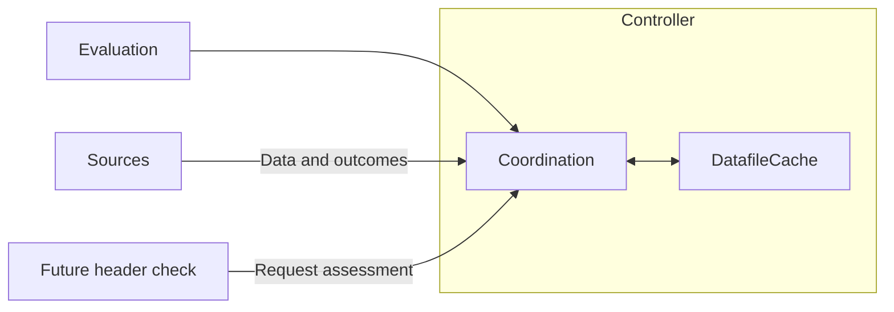

# Cache ownership and extension boundary

The controller owns one `DatafileCache` containing the current tagged datafile.
Sources obtain data and report outcomes. The controller selects the mode, preserves
version acceptance and tagging, and forwards evidence. The cache stores the entry,
records the first consecutive failure, and decides whether it may be served.



## This PR: storage and polling stale-if-error

All modes use the same storage. Polling is the only mode with new serving policy:

1. `onPollData` applies the existing version predicate and tags accepted data.
   It stores accepted data with `set()` and confirms the resulting cache entry.
   A valid equal-version response confirms without replacing the entry.
2. `onPollError` calls `fail()`, retaining the first consecutive error and time.
3. Runtime polling evaluations use `read(staleIfErrorMs)` at the shared controller
   read boundary. The cache enforces the allowance and retains expired data.
4. A valid confirmation clears the failure; a later error starts a new allowance.

`set()` and `clear()` affect storage only. Loading a provided or bundled seed does
not confirm freshness, erase an outage, or renew its deadline. `confirm(snapshot)`
requires the current entry token; each storage write gets a new token, even when
reusing a data object. Confirmation for an older entry cannot clear a replacement
entry's failure. No separate mutable `isFresh` flag is needed.

There is no age-based expiry between successful polls and no read-triggered poll.
Positive finite SIE windows include the exact deadline; zero disables fallback
immediately after an error, and the default `Infinity` preserves unlimited fallback.
Initialization timeout alone is not failure evidence. Existing source startup,
fetching, scheduling, retries, and cancellation remain unchanged. `getDatafile()`
continues to return snapshots independently of the evaluation allowance.

## Future source integrations

| Mode | Evidence that confirms freshness | When updates are unavailable |
| --- | --- | --- |
| Polling — this PR | Accepted poll data or a valid same-version/project/environment response | Existing error events start SIE; polling continues normally |
| Streaming — later | Accepted stream data or a `primed` message matching the cached revision and identity; opening a connection alone is insufficient | Disconnect evidence can activate SIE while existing stream code reconnects |
| Headers — later | A request assessment describes whether this cached version satisfies the required version | Newer versions require SWR/blocking policy; failed refreshes may use SIE |

Streaming policy and header integration are follow-up work. This PR does not wire
stream failures into the cache, add refresh orchestration, or record fetch-age
metadata. The following is the intended header boundary for PR #498, not an API
implemented by this PR:

```ts
const snapshot = cache.peek();
const assessment = headerCheck.check(snapshot);
const decision = cache.read(assessment); // Future request-aware policy overload.
// The controller/source performs any background or blocking refresh.
```

Header parsing, `highestObserved`, and `lastSeen` belong to the header checker,
scoped to project/environment and version. The assessment must carry the snapshot
it describes, `needsRefresh`, and `confirmedAt` as separate facts:

- A matching header can confirm that version only if no newer version was observed.
- A newer required version requests refresh without moving the previous confirmation.
- Missing/malformed headers add no evidence and preserve cached-read behavior.
- An older request must not call global `confirm()` to undo a known invalidation.
  Its read assessment must remain tied to the request and cached entry it checked.

The future policy can combine an entry's fetch time and applicable confirmation:
`freshAt = Math.max(cached.fetchedAt ?? -Infinity, confirmedAt ?? -Infinity)`.
An empty cache requires a blocking fetch. A newer required version uses that age
to choose background stale serving or a blocking refresh; a refresh error then
uses SIE. Unknown-age invalidated seeds require a blocking refresh. Fetching and
request sharing stay outside the cache, and an old assessment cannot renew a
replacement entry. This extension does not require a second datafile store.
